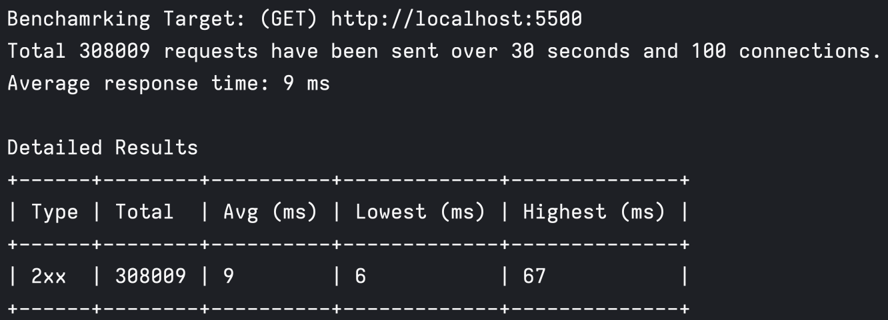

# Cicadas

Cicadas is a multi threaded HTTP load testing and benchmarking tool written in Rust and it's highly inspired by [wrk](https://github.com/wg/wrk). some limitations on wrk and other open source benchmarking tools, make me write my own version with features I needed. Checkout features section, maybe this is the one you're looking for.

-   [Installation](#installation)
-   [Features](#features)
-   [Example](#example)
-   [Options](#options)
-   [Todos](#todos)

## Installation

Working on automation releases. for now you need to compile source code for your desired platform/arch using `cargo`.

## Features

-   Easy to use, fast and cross platform.
-   By leveraging OS threads, you can efficiently utilize CPU cores to maximize connections throughput up to machine hardware limits.
-   Load test your target URL behind a `http` or `socks` proxy.
-   Define custom HTTP method, headers or payload for load testing the target.
-   Detailed categorized analysis based on HTTP status codes.

## Example

This is how you can simply use cicadas to load test `https://example.com` for `10 seconds` with `8` connections.

```bash
cicadas -t http://localhost:5500 -m GET -d 30 -c 100
```



## Options

Target URL for applying load test. `http` and `https` protocols are supported

```
-t --target <TARGET>
```

HTTP method. `GET`,`POST`,`PUT`,`DELETE`,`HEAD` and `OPTIONS` are available

```
-m --method <METHOD>
```

Optional proxy URL to use when load testing the target. `http`,`https` and `socks` protocols are available

```
-P --proxy <PROXY>
```

Load test duration in seconds.

```
-d --duration <DURATION>
```

Connection count. each connection will map with one OS thread.

```
-c --connection <CONNECTION>
```

Optional body payload to pass to the target.

```
-p --payload <PAYLOAD>
```

Optional HTTP headers. you can specify multiple headers with following structure `<NAME>:<VALUE>`.

```
-H --headers <HEADERS>
```

Optional request timeout duration in seconds. default is set to `5` seconds.

```
-T --timeout <TIMEOUT>
```

Print help

```
-h --help
```

Print version

```
-V --version
```

here's an example with all options used.

```bash
cicadas -t https://example.com \
	-m POST \
	-d 30 \
	-c 100 \
	-H "Content-Type:application/json" \
	-P "{id: 5}" \
	-p socks5://mysecretsocks.com \
	-T 7
```

## Todos

-   [ ] Add ‍‍‍‍`deviation` and `percentile` analysis parameters.
-   [ ] Add `async` and non blocking version of HTTP client.
-   [ ] Add an option for specifying file path to store HTTP responses.
-   [ ] Add an option for pass proxy authorization parameters.
-   [ ] Compare performance with other tools like `wrk` and `autocannon`
